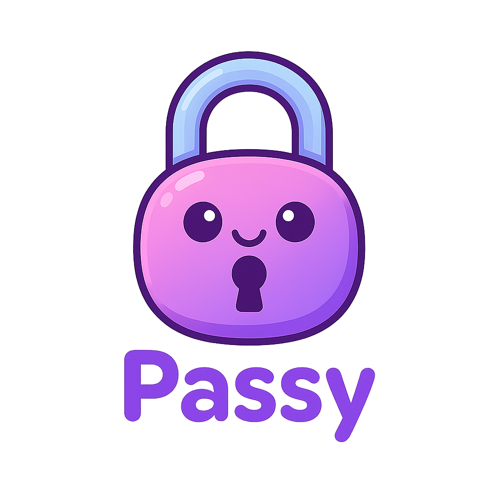

# 🔐 Passy – The Bubbly Password Generator

**Passy** is a stylish, cartoonish web-based password generator designed to create secure, randomized passwords with a fun user experience. Built using Python and Flask, Passy lets users customize the number of letters, symbols, and numbers, then generate and copy their password instantly.



---

## 🌈 Features

- 💡 Randomized secure password generation (letters, numbers, symbols)
- 🔒 Password reveal/hide toggle
- 📋 Copy to clipboard button
- 📱 Mobile-friendly and responsive design
- 🎨 Bubbly, pastel-themed UI with playful cartoon font and logo

---

## 🛠️ Tech Stack

- Python 3.11
- Flask 3.x
- HTML5 + CSS3
- JavaScript (for interactivity)
- Google Fonts: Chewy

---

## 🚀 Run Locally

1. **Clone the repository:**

```bash
git clone https://github.com/javongrey88/passy-password-generator.git
cd passy-password-generator
